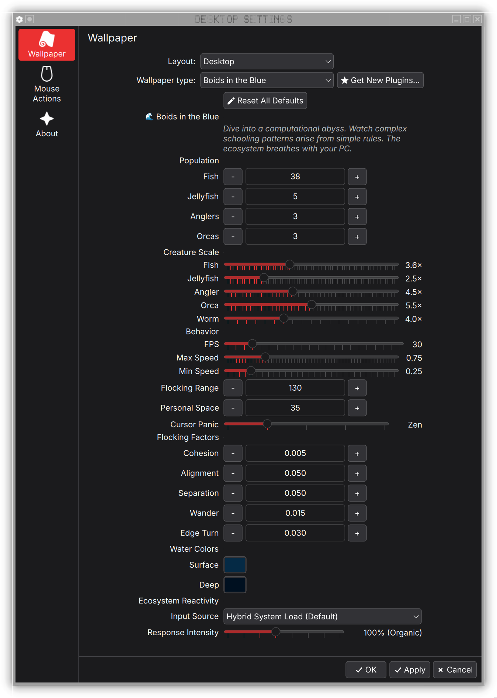

# Boids in the Blue 🐟 (KDE Plasma 6 Live Wallpaper)

```text
       ████
   ██████████
 ██████████◉◉
 ████████████
   ██████
     ██
```

A system-reactive flocking simulation.

## // DEMO

https://github.com/user-attachments/assets/d896e1b9-4d1e-4f65-bfdf-85580c7df1e8

<div align="center">
  
</div>

## // HOW IT WORKS

This wallpaper runs a procedural flocking simulation based on Craig Reynolds’ Boids algorithm (1987), which models lifelike group motion using simple local rules like separation, alignment, and cohesion. The name “Boids” comes from “bird-oid”. It’s built with QML and an HTML5 Canvas renderer for smooth real-time animation.


### 1. Hardware Reactivity

The simulation monitors your system's stress level in real-time.

*   **Hybrid Monitoring**: It checks both CPU and GPU load and reacts to whichever is higher.
*   **Visual Feedback**: When your computer is idle, the flock is calm. When you compile code or play a game, the flock gets agitated, faster, and more chaotic.
*   **Control**: You can adjust how sensitive they are via the Response Intensity slider.

### 2. Ecosystem Logic

*   **The Rules**: Fish follow three simple bird-oid vectors: Separation (don't crash), Alignment (fly together), and Cohesion (stay close).
*   **Life Cycle**: Left-click to spawn worms. If a fish eats 10 worms, it spawns a baby fish. The school grows as you feed it.
*   **Predators & Mob Fear**: Orcas hunt the fish. However, if the school gets dense enough (>20 fish), the predator gets scared and flees. Safety in numbers.

## // INSTALLATION

**Requirements**: KDE Plasma 6 + kpackagetool6

### Option A: Git (Recommended)

```bash
# 1. Clone the repo
git clone https://github.com/arcanorca/boids-in-the-blue.git
cd boids-in-the-blue

# 2. Install
kpackagetool6 --type Plasma/Wallpaper --install .
```

### Option B: Update

If you already have it installed and want the new features:

```bash
cd boids-in-the-blue
git pull
kpackagetool6 --type Plasma/Wallpaper --upgrade .
```

## // OTHER VERSIONS

### 1. Gnome Shell Port
A lightweight port for Gnome Desktop users is included in the `boids-gnome-port` folder.
*   **Supports**: Gnome 45 - 55
*   **Tested On**: Fedora 43 (Other distributions are likely compatible but unverified).
*   **Install**: Copy `boids-gnome-port` to `~/.local/share/gnome-shell/extensions/boids-gnome-port@arcanorca` and restart session.

### 2. Web / HTML5 Port
A standalone HTML5 version is available in the `boids-web` folder.
*   **Usage**: Simply open `boids-web/index.html` in any modern web browser.
*   **Note**: This version does not support hardware reactivity.

## // CONTROLS & CONFIG

**Mouse Interactions:**

*   **Left Click**: Drop food (Worms).
*   **Hover**: Pushes fish away (creates bubble trails).

**Settings Menu:**

*   **Input Source**: Choose between CPU, GPU, Hybrid or custom ID for sensors
*   **Intensity**: Set how hard the flock reacts to system load (25% to 200%).
*   **Zen Mode**: Removes sudden movements for a calmer look.


## // CREDITS

*   **Developer**: arcanorca
*   **License**: GPLv3
*   **Stack**: QML / JavaScript / HTML5 Canvas Context
